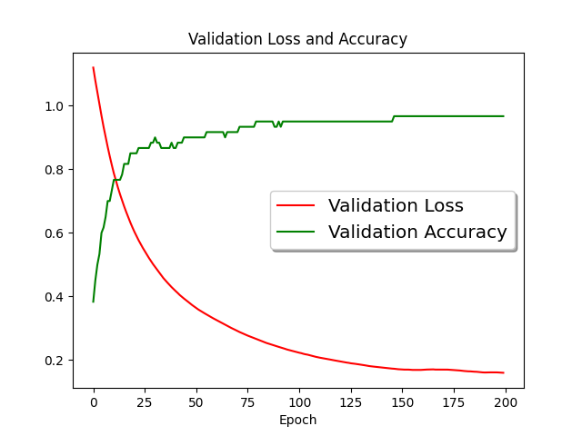

# epre-python

## Installation Guide Windows

Open the terminal and go to the location where you want to clone your repo. Then clone this repo using: 
`git clone <url>`

Now type "`cd epre-python`" to get inside the repo folder.
To setup the environment type the folowing commands:
```
python -m venv .venv
".venv/Scripts/activate"
python -m ensurepip --upgrade
pip install -r requirements.txt
pip uninstall torch 
```
proceed with Y

Now you need to install torch. In order to train the network on gpu, make sure, that you have cuda install on your system. Now you go to https://pytorch.org/get-started/locally/ and select the correct version.
You should enter the command in the terminal (eg. `pip3 install torch torchvision torchaudio --index-url https://download.pytorch.org/whl/cu118`)

Your environment is now setup!

## Testing the environment

In order to test the environment, run "`python src/test_cuda.py`" to check if cuda is available

## Training data

You can find the training data in the shared OneDrive folder. Copy the "processed" folder inside the data folder. If no data folder exists execute the command: `mkdir data`.

In order to avoid warnings with 4-channel .png files run "`python src/dataset_assembly/reload_pngs.py`"

## Train the Model

In order to train the model run: "`python src/train.py`". This will train the model for 200 epochs

To visualize the training results, run: "`python src/plot_training.py`"



If you want to export the checkpoints to android simply run:"`python src/export_model.py`"


